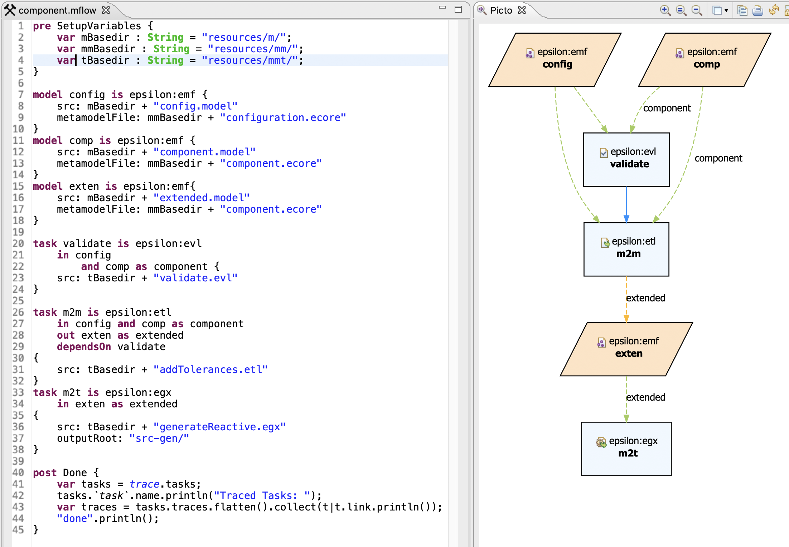

# ModelFlow
A conservative model management workflow execution language.

:warning: This project is work in progress.

## Quick links
- [Wiki](https://github.com/epsilonlabs/modelflow/wiki)
- [MODELS2020](https://github.com/epsilonlabs/modelflow/tree/master/experiments/2020_MODELS)

## Project Structure

- **examples** - Contains Eclipse projects that demonstrate how to use the ModelFlow language
- **integrations** - Configuration of integrations e.g. Maven Plugins
- **experiments** - Experments used for research publications
- **features** - Eclipse features 
- **plugins** - Core development units of the language and the task/model extensions.
- **releng** - Updatesite (for downloading) and Targetplatform (for development)
- **setup** - Other dependencies
- **tests** - Integration and Unit tests of the language
